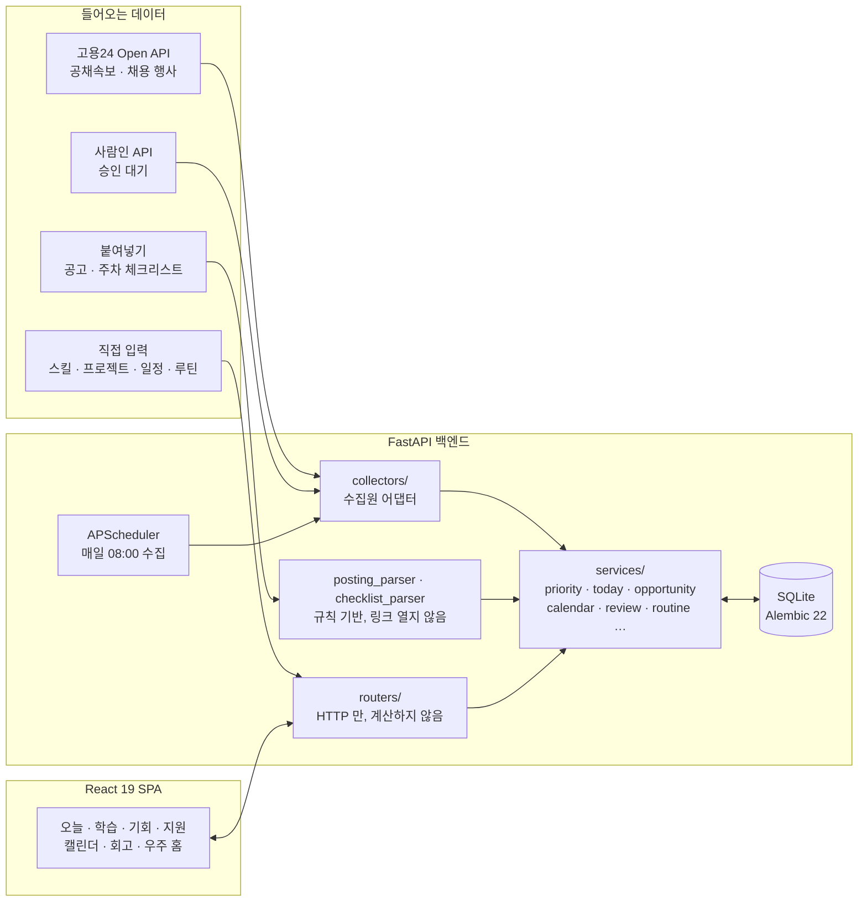

<div align="center">

# Career OS

**흩어진 커리어 준비를 "오늘 할 일"로 바꿔 주는 개인 커리어 운영체제**

### "오늘 뭘 하면 되지?"

공고 · 강의 · 책 · 프로젝트 · 지원서 · 코딩테스트가 전부 따로 노는 상태에서,<br>
**오늘 할 일 몇 가지와 그걸 고른 이유**를 함께 내놓습니다.

<br>

### [→ 데모 열어보기](https://nocked115.github.io/career-os-portfolio/)

설치도 로그인도 없이 열리는 **정적 데모**입니다. 가상 데이터로 만든 실제 앱 화면이고, 둘러볼 수만 있고 저장되지 않습니다.

<br>

`Python` · `FastAPI` · `SQLAlchemy` · `Alembic` · `React 19` · `Vite` · `Docker` · `Railway`

**테스트 603개 · API 170개 · 마이그레이션 22개 · 런타임 의존성 `react` `react-dom` 둘뿐**

</div>

---

## 목차

1. [어떤 서비스인가](#1-어떤-서비스인가)
2. [왜 만들었나](#2-왜-만들었나)
3. [핵심 기능](#3-핵심-기능)
4. [판단은 어떻게 나오는가](#4-판단은-어떻게-나오는가)
5. [기술적으로 신경 쓴 것](#5-기술적으로-신경-쓴-것)
6. [문제 해결 기록](#6-문제-해결-기록)
7. [아키텍처](#7-아키텍처)
8. [기술 스택 · 구조](#8-기술-스택--구조)
9. [실행하기](#9-실행하기)
10. [한계와 다음 단계](#10-한계와-다음-단계)
11. [문서](#11-문서)

---

## 1. 어떤 서비스인가

Career OS 는 **커리어 준비에 필요한 기록을 한곳에 모으고, 그 기록으로 오늘 할 일을 정해 주는 웹 앱**입니다.

채용 공고를 모아 주는 서비스도, 강의를 추천하는 서비스도, AI 로 자기소개서를 써 주는 서비스도 아닙니다.
이미 가진 것 — 모아 둔 공고, 사 둔 책, 하다 만 프로젝트, 매일 풀기로 한 코딩테스트 — 사이의 **우선순위를 정하는 서비스**입니다.

```
발견      DISCOVER   공고 · 인턴 · 공모전 · 채용 행사를 모은다
판단      DECIDE     시장 수요 · 내 레벨 · 증거 · 마감으로 우선순위를 정한다
학습      LEARN      학습 경로 → 주차 단계 → 체크 항목
만들기    BUILD      프로젝트 진행
증명      PROVE      프로젝트 → 경험 → 포트폴리오 → 이력서 문장
지원      APPLY      지원서 보드 · 공고 분석 · 자기소개서
회고      REVIEW     계획 대비 실행 · 미룬 일 · 다음 달에 바꿀 것
             └────────────── 결과가 다시 판단으로 ──────────────┘
```

이 흐름은 **닫혀 있어야** 의미가 있습니다. 한 단계의 결과가 다음 판단에 반영되지 않으면 여러 개의 입력 화면일 뿐입니다.
지금 실제로 이렇게 이어집니다.

```
학습 단계 완료 → 경로 진행률 상승 → 그 스킬의 증거 강화 → 학습 우선순위 하락 → 내일 계획이 달라짐
프로젝트 완료 → "경험으로 저장" 제안 → 포트폴리오 → 공고별 "나와의 연결" 지도에 반영
```

### 하지 않는 것

| 하지 않는 것 | 이유 |
|---|---|
| 새 학습 자료 추천 | 이미 가진 것도 다 못 봅니다. 더 주면 부담만 늘어납니다 |
| 자기소개서 대신 쓰기 | 지어낸 경험이 들어갑니다. 구조와 글자 수, 근거 유무만 확인합니다 |
| "커리어 완료율" 표시 | 커리어에 완료율은 없습니다. 근거를 댈 수 없는 숫자는 만들지 않습니다 |
| 채용 사이트 스크래핑 | 약관이 허용한 공식 API 와 사용자가 직접 붙여넣은 글만 읽습니다 |

---

## 2. 왜 만들었나

데이터 사이언스를 전공하며 Data/AI 직무를 준비하는 동안, 동시에 굴러가는 일이 너무 많았습니다.
캡스톤, 논문 스터디 발표, 수업 두 개와 병행하는 프로젝트, 매일 코딩테스트, 자격증, 그리고 공고와 지원서.

정보가 없어서 막힌 적은 없었습니다. **정보가 서로 연결되어 있지 않아서** 막혔습니다.

```
공고는 북마크만 쌓임            → 그래서 무슨 역량이 부족한지는 모름
강의는 결제만 하고 안 봄         → 왜 지금 그걸 들어야 하는지 모름
프로젝트는 했는데 정리가 안 됨    → 자소서 쓸 때마다 처음부터 떠올림
매주 체크리스트를 새로 만듦       → 체크는 새로고침하면 사라지고, 무엇을 했는지 남지 않음
```

결국 문제는 **의사결정 비용**이었습니다. 무엇을 할지 정하는 데 에너지를 다 쓰고, 정작 실행할 힘이 남지 않았습니다.
그래서 "오늘 뭘 하면 되지?"라는 질문 하나에 답하는 도구를 만들었고, 매일 직접 쓰면서 고치고 있습니다.

### 추천 철학

할 일을 늘리는 도구가 되면 안 된다고 정했습니다.

```
❌  AWS 도 공부하세요. Docker 도 공부하세요. 추천 도서 10권, 공모전 20개를 찾았습니다.

✅  지금 가장 가치가 높은 다음 행동은 이것입니다 — PyTorch 공식 튜토리얼 · 25분
    왜? 모아 둔 기회 4건 중 1건이 요구하는데, 지금 레벨 0 이고 증거가 없습니다.
```

추천은 **적고 · 순서가 있고 · 설명 가능하고 · 바로 할 수 있어야** 하며, 필요하면 **"지금은 안 해도 됩니다"** 라고 말해야 합니다.

---

## 3. 핵심 기능

### 홈 — 커리어 우주

앱을 열면 가운데에 "나"와 목표 직무 준비도가 있고, 궤도에 학습 · 프로젝트 · 기회 · 경험 · 지원 · 내 자료가 돕니다.
천체를 누르면 바로 들어가지 않고 **"지금 볼 이유"** 요약을 먼저 보여 줍니다. 배경의 별은 장식이 아니라 **쌓인 증거의 실제 개수**입니다.

```
                       EXPERIENCE · 경험
   OPPORTUNITIES · 기회  ●              ●  APPLICATIONS · 지원
                    ╭────────────────────╮
 PROJECTS · 만들기 ●  │  Data / AI  69%   │  ●  MY LIBRARY · 내가 가진 것
                    │ 스킬 8개 평균 숙련도 │
                    │  집중 · Machine    │
                    │        Learning    │
                    ╰────────────────────╯
                     ●  LEARNING · 학습

┌ 오늘 ─────────────────────────────┐
│ 먼저 · 논문 스터디 1주차 — CLIP     │
│ 학습 · 45분 · 전체 0/5 끝냄         │
└──────────────────────────────────┘
```

### 오늘 — 할 일과 고른 이유

카드를 늘어놓지 않고, **항목마다 "선택 이유"와 "완료하면 바뀌는 것"** 을 붙입니다.

- **쓸 수 있는 시간은 캘린더가 정합니다.** 활동 시간대에서 수업 · 일정을 빼고, 하루 상한과 비교해 작은 쪽.
- **매일 하는 일(루틴)은 시간을 먼저 떼어 둡니다.** 예: 코딩테스트 30분 · 목표 3문제. 강도별 칸 수는 쓰지 않아 학습이 밀리지 않고, 못 한 루틴은 다음 날로 넘어가지 않습니다.
- **순서:** 3일 안 마감 → 루틴 → 어제 못 한 일 → 14일 안 마감이 있는 학습 · 프로젝트 → 우선순위 1위 스킬 → 진행 중 프로젝트.
- **"왜 이 계획인가"** 를 펼치면 계산에 들어간 원본 숫자(시장 수요 몇 건 중 몇 건, 레벨, 오늘 시간)가 나옵니다. 데이터가 없어 못 쓴 입력도 지우지 않고 흐리게 남깁니다.

```
오늘 할 일                                   계획 2시간 · 강도 보통
 1  학습    논문 스터디 — 1주차 CLIP                        45분
    선택 이유  마감까지 3일 남았습니다. 체크 4개 중 1개 했습니다.
    체크 1/4   · 사전학습 모델 체험  · 미니 CLIP 학습 코드  · 발표 자료 정리
 2  루틴    코딩테스트 (Lv.1)                               30분
    선택 이유  매일 하는 일 · 목표 3문제 · 이번 주 3일 중 3일 함.
    한 개수 [ 3 ] 문제 / 목표 3                     [시작] [오늘은 넘기기]
```

### 학습 — 경로 · 주차 단계 · 체크 항목

- **학습 경로 → 단계(주차) → 체크 항목** 3단계입니다. 체크는 서버에 저장되고, 첫 체크에 단계가 "진행 중"이 됩니다.
- **체크리스트는 붙여넣어 가져옵니다.** 다른 AI 세션에서 만든 주차 체크리스트(HTML 아티팩트 · Markdown)를 붙여넣거나 파일로 불러오면, 제목 · 묶음 · 항목 · 링크를 규칙으로 읽어 **미리보기**로 보여 주고, 뺄 줄을 끈 뒤 저장합니다.
- **다른 세션에 넘길 프롬프트 복사.** 경로 설명 · 이번 단계 · 마감 · 남은 체크 항목 · 붙여넣기 형식을 한 번에 복사해, 다음 주 체크리스트를 같은 형식으로 받아 오게 합니다.
- **모두 체크해도 단계를 저절로 끝내지 않습니다.** 완료를 권할 뿐, 끝났다고 말하는 건 사람입니다.
- **내 자료 서가.** 책 · 영상 · 문서를 "지금 학습 · 다음 학습 · 보류 · 분류 전 · 완료" 가로 레일로 나누고, 최근 많이 다룬 자료에 `HOT` 순위를 붙입니다. 세션마다 **"지금 안 해도 되는 자료"를 개수와 이유까지** 보여 줍니다.

### 기회 — 모으고, 고르고, 치운다

- **공고 붙여넣기.** 공고 본문을 붙여넣으면 제목 · 기관 · 마감 · 요구 스킬 · **지원 자격 경고**(경력 · 학력 · 어학 · 자격증)를 규칙으로 채워 미리보기합니다. 앱은 붙여넣은 글만 읽고 링크를 열지 않습니다.
- **고용24 공채속보 자동 수집.** 공식 Open API 로 매일 08:00 수집합니다. 제목에는 직무가 거의 안 나와서, **모집 부문의 직무 설명**으로 데이터 · AI 공고를 고릅니다.
- **고용24 채용 행사.** 수도권 취업박람회 · 채용설명회를 일시 · 장소와 함께 가져옵니다. 담당자 연락처는 저장하지 않습니다.
- **매칭 점수와 판정.** 관련도 · 준비도 · 포트폴리오 가치 · 마감 여유로 100점을 매기고 "지금 할 만해요 / 고려해 볼 만해요 / 지금은 아니에요"로 나눕니다. 자격 경고 옆에는 **내 어학 · 자격증**을 나란히 두되, 충족 여부는 판단하지 않습니다.
- **칸.** 검토 중 · 지원 중 · 보류 · 관심 없음 · **보관함**(지원서 철회 · 불합격 · 마감 지남 · 지난 행사). 판단이 끝난 기회는 판단할 목록에서 빠집니다. 종류(채용 · 공모전 · 대외활동 · 채용 행사)는 연한 색으로 구분합니다.

### 지원 · 증명

- **지원서 보드.** 관심 → 준비 중 → 준비 완료 → 지원함 → 서류 통과 → 면접 → 결과. 허용된 이동만 가능하고, 막히면 한국어로 이유를 말합니다.
- **공고 분석과 경험 추천.** 공고에서 스킬을 강 · 중 · 공백으로 나누고(한글 조사 · 별칭 처리), 저장된 경험 중 맞는 것을 추천합니다.
- **자기소개서.** 문항별 초안 · 버전 · 글자 수. 구조 잡기와 점검은 해 주지만 **문장을 대신 쓰지 않습니다.**
- **프로젝트 → 경험 → 포트폴리오.** 프로젝트를 끝내면 경험으로 저장을 제안하고, 포트폴리오 항목에서 이력서 문장을 만듭니다.
- **자격증 · 어학.** 만료 180일 전부터 알려 줍니다. 자격번호 · 수험번호 칸은 일부러 두지 않았습니다.

### 캘린더 · 한눈에 보기 · 회고

- **캘린더.** 월 · 주 · 일 보기, 매주 수업, 하루 일정, 종일 일정, 마감과 채용 행사를 한 격자에. 루틴 카드도 여기 있습니다.
- **한눈에 보기.** 목표 준비도 · 이번 주 실행 · 학습 · 프로젝트 · 증거 · 지원서 · 7일 안 마감을 한 장으로. 숫자는 늘 분모와 함께("5개 중 3개") 씁니다.
- **회고.** 계획 대비 실행률, 반복해서 미룬 일, 규칙으로 고른 **다음 달에 바꿀 것**(근거 숫자 포함), 그리고 **한 달 스스로 평가**(1~5점 · 잘한 것 · 아쉬운 것 · 다음 달 초점). 기록이 적으면 제안하지 않습니다.

---

## 4. 판단은 어떻게 나오는가

계산은 전부 `backend/app/services/` 에 있고, 화면과 라우터는 계산하지 않습니다.

### 무엇을 배울 것인가 — 학습 우선순위

```
market_percentage = 그 스킬을 요구하는 기회 수 / 모아 둔 기회 수 × 100
                    (채용 시장 전체가 아니라 "내가 모아 둔 것")
skill_gap         = max(0, 4 − 내 레벨)
evidence_strength = 프로젝트가 어디까지 갔는지
                    만들기로 함 0.10 · 만드는 중 0.25 · 완성 0.50 · 보여줄 수 있음 0.70 · 경험으로 남음 0.85
                    (학습 진행률과 겹치는 만큼 빼고 합칩니다)

priority_score    = market_percentage × skill_gap × max(0.15, 1 − evidence_strength) × target_weight
```

**증거가 점수를 낮추는 방향**이 핵심입니다. 이미 프로젝트로 증명 중인 스킬은 덜 급합니다.
반대로 설계하면 이미 잘하는 것만 계속 공부시키는 시스템이 됩니다.

### 오늘 몇 분을 쓸 것인가

```
활동 시간대 09:00–22:00   780분
− 수업 · 일정 (겹침 한 번)   420분
= 빈 시간                 360분
  하루 상한               180분
→ 오늘 제안               180분     "수업이 없는 시간" 이 "공부할 수 있는 시간" 은 아니다
```

### 그래서 오늘 무엇을 할 것인가

"무엇이 부족한가"와 "오늘 무엇을 하나"는 다른 질문이라 두 층으로 나눴습니다.

```
SKILL NEED        시장 수요 · 목표 · 격차 · 증거          → 무엇이 부족한가
ACTION SELECTION  마감 · 루틴 · 이월 · 마감 있는 학습 · 우선순위 · 프로젝트  → 그래서 오늘 뭘 하나
```

프로젝트는 스킬 순위를 타지 않고 **자기 자격으로** 후보가 됩니다. 프로젝트가 있다는 사실은 "그 스킬을 새로 배울 필요"는 낮추지만 "그 프로젝트를 끝낼 필요"는 오히려 높이기 때문입니다.

---

## 5. 기술적으로 신경 쓴 것

### LLM 을 넣지 않았다 — 판단은 규칙, 계획 초안은 사람이 고른 AI 세션

주차 체크리스트 같은 "무엇을 할지"는 AI 세션이 잘 만듭니다. 하지만 앱 안에 LLM 을 넣으면 **"이만하면 했다고 봐도 되나"를 모델이 판정**하게 됩니다.
그래서 역할을 나눴습니다. 계획 초안은 AI 세션이, **기록 · 진행률 · 우선순위 · 레벨 규칙은 앱**이 맡습니다. 둘 사이는 붙여넣기 형식과 인수인계 프롬프트로 잇습니다.
모든 판단에는 원본 숫자가 붙고, 레벨은 체크로 자동으로 오르지 않습니다.

### 외부 데이터는 약관이 허용한 길로만

- **공식 API 만 씁니다.** 고용24 공채속보 · 채용 행사(공식 Open API), 사람인(공식 API, 승인 대기). 채용 사이트 스크래핑은 하지 않고, 나머지는 **사용자가 붙여넣은 글**만 읽습니다.
- **출처를 표시하고, 공개 데모에서는 수집원을 끕니다** (비영리 · 재배포 금지 조건).
- **개인정보를 저장하지 않습니다.** 채용 행사 상세의 담당자 이름 · 전화 · 이메일은 읽지 않고, 자격증에는 번호 칸이 없습니다.
- **인증키가 로그에 남지 않습니다.** 수집원 오류 메시지에 URL 을 넣지 않고 오류 종류만 남깁니다.

### 설명 가능한 숫자

- **퍼센트는 분모와 함께.** 기회가 1건일 때 `100%` 라고만 쓰면 화면이 거짓말을 합니다.
- **모르는 것은 비워 둡니다.** 공고에 마감이 없으면 마감을 만들지 않고, 채용 행사 원문 링크가 없으면 주소를 짓지 않습니다.
- **판정에 쓰지 못한 입력도 보여 줍니다.** 칸이 사라지면 무엇을 못 봤는지 알 수 없습니다.

### 안전한 배포 · 데이터

- **Fail-closed 인증.** 운영 모드인데 자격 증명이 없으면 앱이 아예 뜨지 않습니다. 기본 비밀번호나 조용한 인증 해제는 실수 한 번에 커리어 기록 전체를 공개합니다.
- **한 이미지, 세 모드.** 실사용(인증 · 쓰기) / 읽기 전용(인증 · 쓰기 차단) / 공개 데모(인증 없음 · **쓰기 강제 차단**). "공개인데 쓰기 가능"은 만들 수 없게 했습니다.
- **백업은 API 로.** 메타데이터를 읽어 전체 테이블을 기본키째 내보내고 불러옵니다. **스키마 리비전이 다르면 거부**합니다 — 컬럼 하나가 조용히 빠진 채 들어가는 것이 지우는 것보다 나쁩니다.
- **스키마는 Alembic 으로만.** 22개 마이그레이션, `alembic check` 로 모델과 일치를 확인합니다. SQLite 제약 때문에 컬럼 추가는 배치 변경으로 합니다.

### 가벼운 프런트엔드

- **런타임 의존성은 `react` · `react-dom` 둘뿐.** 차트 · 상태 관리 · 라우터 라이브러리를 쓰지 않았습니다.
- **해시 라우터를 직접 구현**했습니다. 경로가 10여 개라 라이브러리가 무겁고, 해시 라우팅은 서버 설정 없이 정적으로 올라갑니다.
- **궤도는 CSS + SVG.** Three.js 를 쓰면 번들이 몇 배가 됩니다.
- **공용 UI 조각**(`ui.jsx`)과 **읽기 전용 컨텍스트** — 쓰기 버튼은 데모에서 자동으로 비활성화됩니다.

### 테스트

603개(602 통과 · 1 건너뜀). 계산 규칙, API, 마이그레이션 경계, 수집원(가짜 XML 로 필터 · 필드 · 키 노출 방지 · 연락처 미저장), 삭제 시 남는 것(끝낸 기록은 남기고 없는 대상을 가리키는 할 일은 치우는지)까지 확인합니다.
테스트는 외부 API 를 부르지 않습니다 — 실제로 한 번 불렀던 적이 있어서 막았습니다(아래 기록 참고).

---

## 6. 문제 해결 기록

매일 실제로 쓰면서 나온 문제들입니다. 전체 기록은 [docs/DECISIONS.md](docs/DECISIONS.md) 에 있습니다.

### ① 프로젝트를 등록하면 그 프로젝트가 오늘 계획에서 사라졌다
- **증상** 60% 진행 중인 프로젝트를 스킬에 연결하자 다음 날 계획에서 빠졌습니다.
- **원인** 오늘 계획이 우선순위 1위 스킬의 할 일만 봤는데, 프로젝트를 붙이면 증거가 생겨 그 스킬이 1위에서 내려갔습니다.
- **해결** "스킬을 새로 배울 필요"와 "프로젝트를 끝낼 필요"를 분리해, 프로젝트는 스킬 순위와 무관하게 후보가 되게 했습니다.
- **배운 점** 추상적인 지적("두 우선순위를 섞는다")을 그대로 받아 적지 않고 재현하니, 더 좁고 구체적인 결함이 나왔습니다.

### ② 빈 프로젝트 하나가 우선순위를 반토막 냈다
- **증상** 아무것도 안 한 0% 프로젝트를 만들기만 해도 그 스킬 점수가 절반이 됐습니다.
- **원인** "프로젝트 있음/없음"만 보고 가중치를 곱했습니다.
- **해결** 만들기로 함 → 만드는 중 → 완성 → 보여줄 수 있음 → 경험으로 남음, **증거의 세기 5단계**로 바꿨습니다. 기존에 맞던 두 기준점은 유지했습니다.

### ③ 토요일 발표가 어제 못 한 일에 밀려 계획에서 빠졌다
- **증상** 3일 뒤 논문 발표 주차가 오늘 할 일 목록에 없었습니다.
- **원인** 후보 순서가 "마감 → 이월 → 학습"이라, 이월된 자료 두 개가 하루 칸을 먼저 차지했습니다.
- **해결** 3일 안 마감인 학습 · 프로젝트를 이월보다 앞에 두고, 이를 재현하는 테스트를 추가했습니다. 이월은 내일 해도 되지만 발표일은 옮길 수 없습니다.

### ④ 공채 공고 264건 중 제목으로 걸리는 데이터 직무는 1건
- **증상** 제목 키워드 필터로는 데이터 · AI 공고를 거의 찾지 못했습니다. "대졸 신입사원 모집" 안에 데이터 직무가 숨어 있었습니다.
- **1차 해결** 상세 API 의 모집 부문 직무 설명까지 봤더니 35건이 남았는데, **절반이 "급여 데이터 관리" 같은 인사 · 영업 직무**였습니다.
- **2차 해결** 말을 두 층으로 나눴습니다. "데이터 분석 · 빅데이터 · 머신러닝 · NLP" 같은 강한 말은 어디서든, "AI · 데이터" 같은 짧은 말은 **제목이나 부문 이름에서만**. 19건으로 줄고 정밀도가 크게 올랐습니다.

### ⑤ 테스트가 5분을 넘기며 실제 API 를 부르고 있었다
- **증상** 수집기를 추가한 뒤 전체 테스트가 끝나지 않았습니다.
- **원인** 앱이 시작할 때 `.env` 를 읽는데, 거기에 진짜 인증키가 들어가자 자동화를 도는 테스트가 **실제로 공고 264건과 상세를 호출**했습니다.
- **해결** 모든 테스트에서 제공자 키를 지우는 autouse fixture 를 두고, 키가 필요한 테스트만 가짜 키를 넣게 했습니다. 30초대로 돌아왔습니다.

### ⑥ 백업이 성공했다면서 빈 파일을 만들었다
- **증상** 스크립트로 내보내기를 돌리면 테이블이 0개인 백업이 "성공"으로 나왔습니다.
- **원인** 내보내기 모듈이 모델을 임포트하지 않아 메타데이터가 비어 있었습니다. API 로 부를 때는 다른 모듈이 먼저 임포트해서 드러나지 않았습니다.
- **배운 점** 백업 도구에서 가장 나쁜 실패는 "백업이 있다고 믿게 하는 것"입니다. 이후 스키마 리비전 불일치도 거부하도록 했습니다.

---

## 7. 아키텍처



- **소스 독립.** 모든 수집원은 같은 `fetch → normalize` 계약으로 정규화해 `Opportunity` 하나로 들어옵니다. 수집원을 바꿔도 판단 로직은 그대로입니다.
- **계산은 한 곳에서.** 우선순위 · 오늘 계획 · 매칭 · 회고 계산은 `services/` 에만 있습니다. 같은 숫자를 두 화면이 다르게 말하지 않게 하기 위해서입니다.
- **컨테이너 하나.** 빌드된 화면과 API 를 같은 서비스가 냅니다. 1인용 앱에 CORS · 두 개의 URL · 두 번의 배포를 둘 이유가 없었습니다.

---

## 8. 기술 스택 · 구조

| 영역 | 사용 기술 |
|---|---|
| **Backend** | Python 3.13 · FastAPI · SQLAlchemy 2 · Pydantic 2 · Alembic · APScheduler · SQLite |
| **Frontend** | React 19 · Vite · 순수 JavaScript · 순수 CSS (디자인 토큰) |
| **데이터 연동** | 고용24 Open API (XML) · 사람인 API · 규칙 기반 파서 |
| **품질** | pytest 603개 · oxlint · OpenAPI (Swagger) |
| **배포** | Docker 단일 컨테이너 · Railway · Basic Auth · 읽기 전용 / 공개 데모 모드 |

### 규모

| 항목 | 값 |
|---|---|
| 개발 기간 | 2026-08-09 ~ 진행 중 (커밋 100개) |
| 백엔드 | 약 17,000줄 · 67파일 · API 170개 |
| 프런트엔드 | 약 24,000줄 |
| 테스트 | 603개 · 테스트 파일 52개 |
| 마이그레이션 | 22개 |

### 폴더 구조

```
career-os/
├── Dockerfile                 화면 빌드 + API 를 한 컨테이너로
├── docs/                      제품 정의 · 설계 · 결정 기록
├── backend/
│   ├── app/
│   │   ├── services/          판단이 사는 곳
│   │   │   ├── priority.py        학습 우선순위 (단일 출처)
│   │   │   ├── today.py           오늘 계획 — 시간 · 루틴 · 마감 · 이월
│   │   │   ├── routine.py         매일 하는 일 · 목표 올리기 제안
│   │   │   ├── checklist*.py      체크리스트 저장 · 붙여넣기 파서
│   │   │   ├── handoff.py         다른 세션에 넘길 프롬프트
│   │   │   ├── opportunity.py     수집 저장 · 매칭 점수 · 칸(보관함)
│   │   │   ├── posting_parser.py  붙여넣은 공고 → 칸 · 자격 경고
│   │   │   ├── calendar.py        빈 시간 · 월/주/일
│   │   │   ├── review.py          계획 대비 실행 · 다음 달 제안 · 스스로 평가
│   │   │   └── …                  why · universe · library · jd · proof · certificates
│   │   ├── collectors/        수집원 어댑터 — mock · saramin · work24 · work24_events
│   │   ├── routers/           HTTP 만
│   │   ├── auth.py            Basic Auth · 읽기 전용 · 공개 데모
│   │   └── models.py  schemas.py  main.py  scheduler.py
│   ├── alembic/versions/      마이그레이션 22개
│   └── tests/                 603개
└── frontend/src/
    ├── components/            화면 (Today · Learning · Opportunities · Calendar · Review …)
    ├── components/ui.jsx      공용 조각 — 버튼 · 빈 상태 · 근거 패널 · 진행 막대
    ├── router.js              해시 라우터 (직접 구현)
    └── api.js                 API 접근 단일 출처
```

---

## 9. 실행하기

### 데모로 둘러보기

[데모](https://nocked115.github.io/career-os-portfolio/)는 서버 없이 GitHub Pages 에서 열리는 정적 데모입니다. 가상 데이터를 넣은 임시 DB 에서 화면이 읽는 API 응답을 미리 녹화해 두고, 앱이 서버 대신 그 파일을 읽습니다. 저장은 되지 않고, 날짜와 D-day 는 만든 날 기준입니다.

```bash
bash scripts/build_static_demo.sh   # → static-demo/ (녹화 → 정적 빌드)
```

### 로컬 실행

```bash
# 백엔드
cd backend
python3 -m venv .venv
./.venv/bin/pip install -r requirements-dev.txt
./.venv/bin/alembic upgrade head          # 스키마는 Alembic 이 관리합니다
./.venv/bin/python -m app.demo            # (선택) 가상 데이터 채우기
./.venv/bin/uvicorn app.main:app --reload # http://127.0.0.1:8000  ·  문서 /docs
```

```bash
# 프런트엔드
cd frontend
npm install
npm run dev                               # http://localhost:5173
```

```bash
# 테스트 · 린트
cd backend && ./.venv/bin/pytest
cd frontend && npm run lint
```

### 외부 채용 API (선택)

`backend/.env` 에 키를 넣으면 해당 수집원이 켜집니다. 키가 없으면 수집원은 꺼지고 붙여넣기로 씁니다.

| 변수 | 수집원 |
|---|---|
| `WORK24_API_KEY` | 고용24 공채속보 · 채용 행사 |
| `SARAMIN_API_KEY` | 사람인 채용공고 |

고르는 말과 지역은 `CAREER_OS_WORK24_KEYWORDS` · `CAREER_OS_WORK24_EVENT_REGIONS` 등으로 바꿀 수 있습니다.

### 배포

```bash
docker build -t career-os .
docker run -p 8000:8000 \
  -e CAREER_OS_ENV=production \
  -e CAREER_OS_AUTH_USER=... -e CAREER_OS_AUTH_PASSWORD=... \
  -v career-os-data:/data career-os
```

| 모드 | 변수 | 인증 | 쓰기 |
|---|---|---|---|
| 실사용 | (없음) | 필요 | 가능 |
| 읽기 전용 | `CAREER_OS_READ_ONLY=1` | 필요 | 차단 |
| 공개 데모 | `CAREER_OS_PUBLIC_DEMO=1` · `CAREER_OS_SEED_DEMO=1` | 없음 | **강제 차단** |

자세한 내용은 [docs/DEPLOY.md](docs/DEPLOY.md).

---

## 10. 한계와 다음 단계

솔직하게 적습니다. 못 하는 것을 숨기면 판단을 믿을 수 없게 됩니다.

| 한계 | 지금 | 다음 |
|---|---|---|
| **공고 출처가 좁다** | 고용24(공채 · 행사)와 붙여넣기. 사람인은 승인 대기 | 공공기관 채용정보 · 원티드 API 연동 |
| **공고 필터가 규칙 기반** | 직무 설명 속 "데이터 분석"이 마케팅 공고에도 걸림 | 실제 사용하며 말 목록 조정, 부문 단위 판정 |
| **안내 도우미에 LLM 없음** | 키워드로 의도를 나눠 저장된 데이터를 보여 줌. 그래서 "튜터"가 아니라 "안내"라고 부름 | 필요한 곳(공고 문맥 이해)부터 제한적으로 |
| **행동 점수화 없음** | 오늘 할 일은 규칙 기반 순서 | 실행 기록이 쌓이면 가중치 검토 |
| **학습 체크 항목에 시간 없음** | 오늘 계획은 다음 항목을 보여 줄 뿐 시간을 채우지 않음 | 항목별 예상 시간 |
| **SQLite 단일 인스턴스** | 1인 사용 전제 | 다중 사용자가 필요해지면 PostgreSQL |

---

## 11. 문서

| 문서 | 답하는 질문 |
|---|---|
| [PRODUCT.md](docs/PRODUCT.md) | 왜 만드는가 · 북극성 · 추천 철학 |
| [FEATURES.md](docs/FEATURES.md) | 기능별 명세와 구현 상태 |
| [USER_FLOW.md](docs/USER_FLOW.md) | 기능이 어떻게 이어지는가 |
| [DATA_MODEL.md](docs/DATA_MODEL.md) | 테이블과 마이그레이션 |
| [DECISIONS.md](docs/DECISIONS.md) | 무엇을 정했고 무엇을 포기했는가 (문제 해결 전체 기록) |
| [CHECKLIST_FORMAT.md](docs/CHECKLIST_FORMAT.md) | 체크리스트 붙여넣기 형식 · 다른 세션과 주고받는 법 |
| [DESIGN.md](docs/DESIGN.md) | 화면 설계 |
| [DEPLOY.md](docs/DEPLOY.md) | 배포 · 인증 · 데이터 이동 |
| [CURRENT_STATE.md](docs/CURRENT_STATE.md) | 지금 코드에 실제로 있는 것 |

---

<div align="center">

> **"나는 이런 커리어를 원한다"** 와 **"그래서 오늘 정확히 무엇을 해야 하는지 안다"** 사이의 간격을 줄이기 위해 만들었습니다.

Shoot for the moon — even if you miss, you'll land among the stars.<br>
홈 배경의 별은 **쌓인 증거의 실제 개수**입니다. 떨어진 지원도 하나로 셉니다.

</div>
